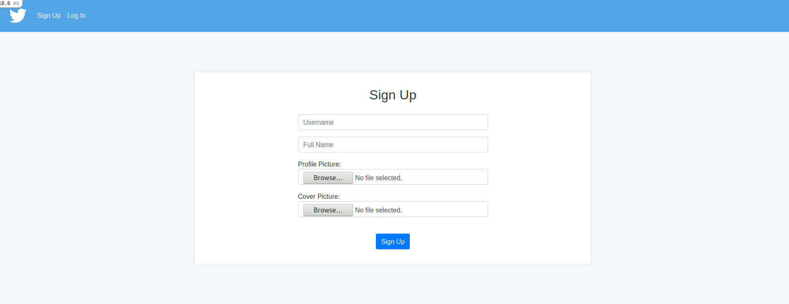
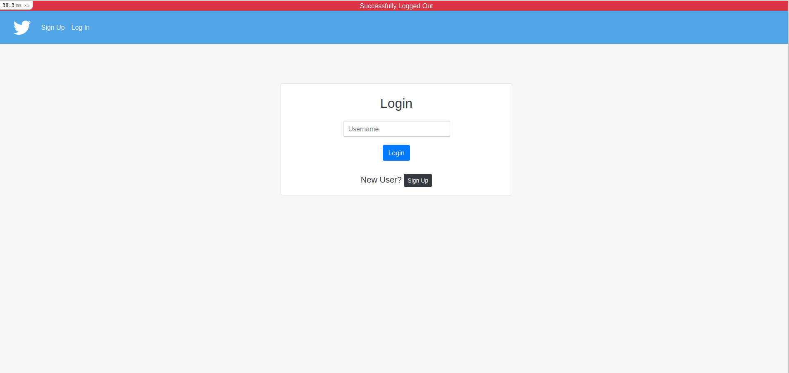
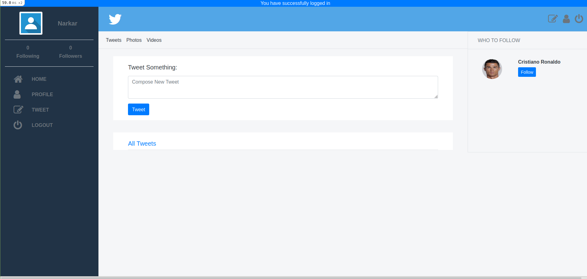
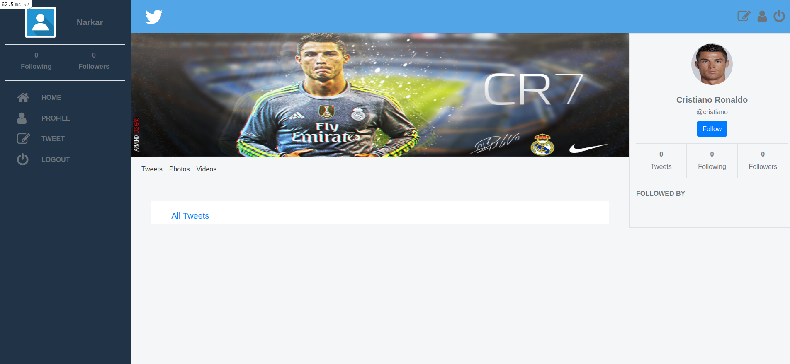
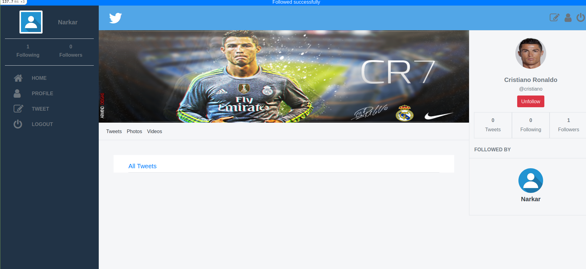
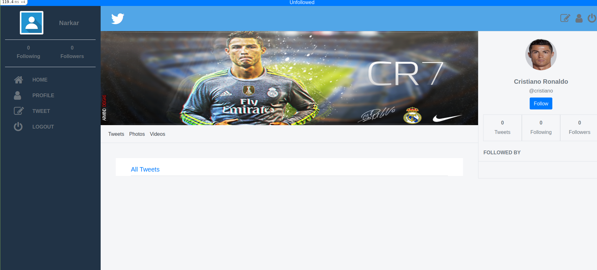
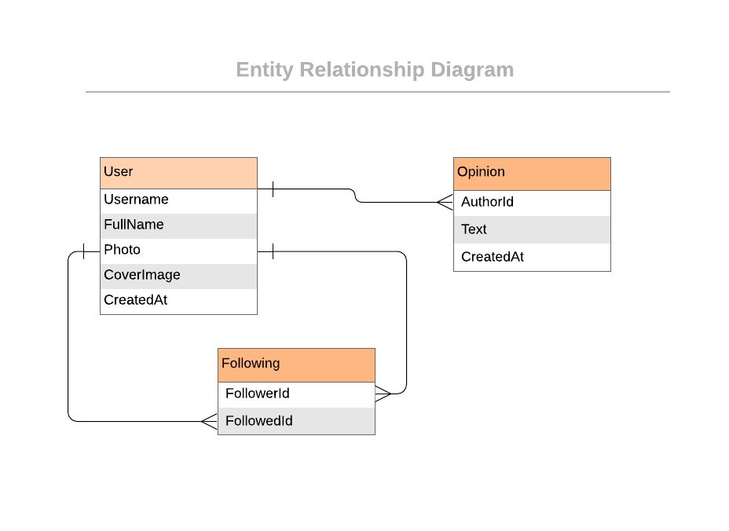

# Banter Twitter

## Project Specification

Creating an MVP of redesigned twitter and using it for Football/Sports Banter! It has basic features of Twitter.

## Built for screens above 1280px only!

Design For Reference - https://www.behance.net/gallery/14286087/Twitter-Redesign-of-UI-details

### MVP version of the app has the following features:

1. The user logs in to the app, only by typing the username (a proper authenticated login is **not** a requirement).

2. The user is presented with the homepage (see the _Homepage_ screenshot above) that includes:

   1. Left-side menu (includes only links to pages that are implemented).
   2. _Tweets_ tab in the centre (skip _Photos_ and _Videos_ for this MVP).
   3. Right-side section with *Who to follow (*skip _Trending for_ this MVP).

3. The _Tweets_ section includes:

   1. Simple form for creating a tweet.
   2. List of all tweets (sorted by most recent) that display tweet text and author details.

4. The _Who to follow_ section includes:

   1. List of profiles that are not followed by the logged-in user (ordered by most recently added).

5. When the user opens the profile page (see the _Userpage_ screenshot above), they can see:

   1. Left-side menu (includes only links to pages that are implemented).
   2. Cover picture and _Tweets_ tab in the centre (skip other tabs and _Tweet to user_ form).
   3. Right-side section with _Profile detailed info._

6. The _Profile detailed info_ section includes:

   1. User photo.
   2. Button to follow a user.
   3. Stats: total number of tweets, number of followers and number of following users.
   4. List of people who follow this user.

7. At the end extend your MVP app with one simple feature of your choice. (Unfollow a user you have followed)

### Sign Up Page



### Login Page



### Home Page



### Profile Page



### On Follow Page



### Unfollowed



### ERD



## Built With

- Ruby v2.7.2
- Ruby on Rails v6.1

## Live Demo

#### [Banter Twitter](https://twitter-redesigned-akshay.herokuapp.com/)

## Getting Started

To get a local copy up and running follow these simple example steps.

### Prerequisites

- Ruby: 2.7.2
- Rails: 6.1.3
- Postgres: >=9.5
- Yarn: >= 1.22

### Setup

- Clone this repository

  ```
   git clone git@github.com:akshay-narkar/twitter-resdesign-capstone.git)

  ```

- Open terminal
- Change directory by using

  ```
  cd twitter-redesign-capstone

  ```

- Install gems with:

  ```
  bundle install
  ```

- Setup database with:

  ```
     rails db:create
     rails db:migrate
  ```

### Usage

Start server with:

```
    rails server
```

Open `http://localhost:3000/` in your browser.

### Run tests

```
    bundle exec rspec
```

### Deployment

From console run the following commands after cloning

- Sign in Heroku.
- Open your terminal.
- Run
  ```
  heroku login.
  ```
- If you get any error, run
  ```
  sudo snap install --classic heroku
  ```
  ```
  heroku create twitter-redesign (or any app name you like)
  ```
  ```
  git push heroku main (pushing from the main branch to main branch on heroku)
  ```

## Authors

👤 **Author1**

- Github: [@akshay-narkar](https://github.com/akshay-narkar)
- Twitter: [Akshay](https://www.twitter.com/akidoit)

## 🤝 Contributing

Contributions, issues and feature requests are welcome! Start by:

- Forking the project
- Cloning the project to your local machine
- `cd` into the project directory
- Run `git checkout -b your-branch-name`
- Make your contributions
- Push your branch up to your forked repository
- Open a Pull Request with a detailed description to the development branch of the original project for a review

## Show your support

Give a ⭐️ if you like this project!

## Acknowledgments

- Thanks to Odin project for the tutorials.

## 📝 License

This project is [MIT](LICENSE) licensed.
